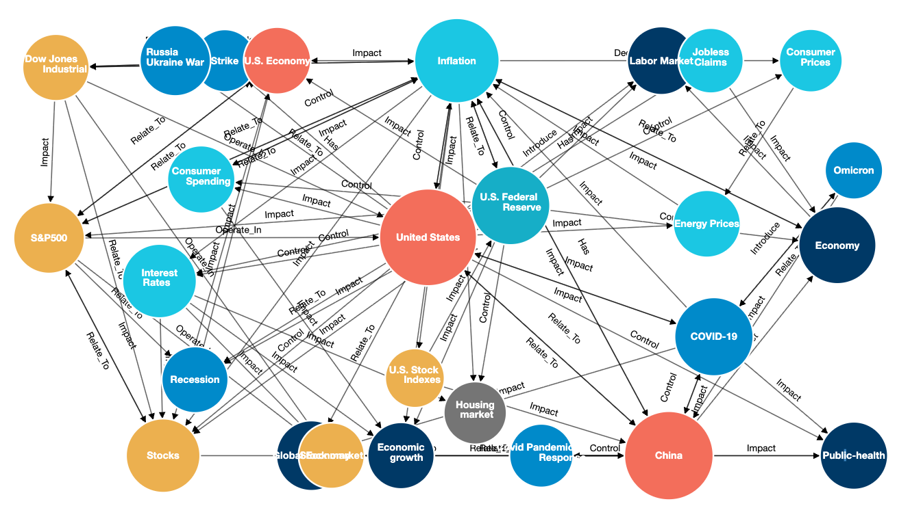
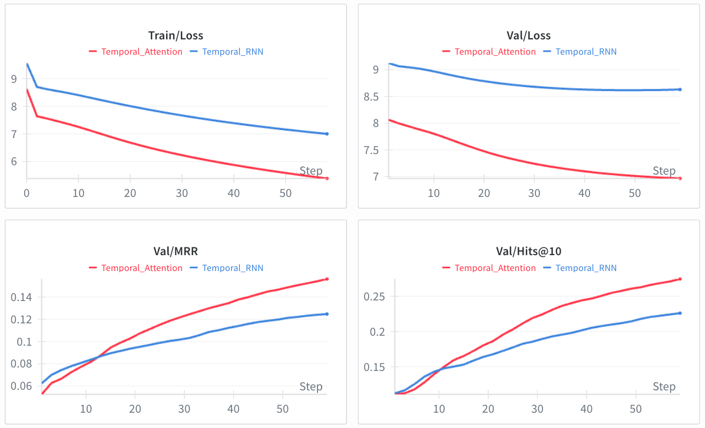

### Background

Many real‑world systems can be modeled as **heterogeneous temporal knowledge graphs**, where time‑stamped triplets `(head, relation, tail, time)` describe evolving interactions between diverse entities.  
Classical static knowledge graph embedding models and simple temporal extensions often assume that a single embedding per entity–relation pair is sufficient, ignoring how the *trajectory* of events and their ordering shape future predictions.  
Recent work on temporal KGs and dynamic graphs—such as **Know‑Evolve** (Trivedi et al., 2017), **DyRep** (Trivedi et al., 2019), **RE‑NET** (Jin et al., 2020), **TGAT** (Xu et al., 2020), and **TGN** (Rossi et al., 2020)—demonstrates that explicitly modeling time greatly improves performance, but also introduces new architectural and optimization challenges.  
Our goal in this project is to understand how two deep temporal models—a recurrent KGTransformer and a temporal attention model—behave on a challenging financial temporal KG, and what it takes to make the attention‑based model competitive and stable.

Our experiments are conducted on **FinDKG**, a large‑scale financial dynamic knowledge graph introduced by Du et al. (2024).  
The graph contains many different node and relation types and evolves over time, making it a good example of a **heterogeneous temporal knowledge graph**.

There are several reasons why temporal modeling is hard in this setting:

- **High heterogeneity.** Multiple node and relation types interact (e.g., firm–firm trade, firm–index membership, firm–news, firm–sector), breaking many of the assumptions behind homogeneous temporal graph models such as TGAT (Xu et al., 2020) and TGN (Rossi et al., 2020).  
- **Multi‑aspect temporal signals.** Structural relations co‑evolve with prices, fundamentals, macro events and news; the same edge type can mean different things in different regimes.  
- **Non‑stationarity and regime shifts.** Shocks, crises and policy changes can abruptly change which patterns are predictive, making long‑range extrapolation difficult.  
- **Evaluation on truly future edges.** Following FinDKG, we predict links at later time intervals given only the past, rather than randomly masking edges within a single snapshot; this exposes weaknesses in purely static KG models such as TransE, DistMult and ComplEx.

Static KG embedding models and lightweight temporal variants (e.g., HyTE, Know‑Evolve, RE‑NET) tend to compress each entity–relation pair into a small number of vectors and treat time as either a discrete index or an extra embedding dimension.  
On FinDKG, this proves insufficient: we find that **static and weakly temporal baselines underperform markedly** when asked to forecast future financial edges, because they discard the fine‑grained *trajectory* of interactions that precede each event.

To address this, the FinDKG benchmark includes a **deep temporal baseline** based on a KGTransformer with recurrent updates, in the spirit of DyRep (Trivedi et al., 2019) and other dynamic KG models.  
The model maintains a **per‑entity temporal state** that is updated as new edges arrive, and uses this state together with static and structural embeddings to predict future links.  
This recurrent baseline already demonstrates that **explicit temporal modeling is crucial**: it significantly outperforms the static models on temporal link prediction metrics such as mean reciprocal rank (MRR) and Hits@10.

In this report we explore a stronger hypothesis:

> On complex, heterogeneous financial graphs, **replacing recurrent temporal updates with a Transformer‑style attention mechanism** over each entity’s recent history can capture richer temporal dependencies and potentially improve predictive accuracy.

Concretely, we extend the FinDKG baseline with a **temporal attention module** that:

1. Uses a relational graph convolution (RGCN / KGTransformer) to compute structural node embeddings at each time step.  
2. Maintains, for each entity, a sliding window of its recent structural states and time‑stamps.  
3. Applies multi‑head scaled dot‑product attention (Vaswani et al., 2017) over this window, using temporal positional encodings to weight past states according to both content and time gaps.  
4. Feeds the resulting temporal embedding into a link‑prediction decoder together with static and structural embeddings.

This design aims to generalize the recurrent FinDKG model in the same way that Transformers generalize RNNs in sequence modeling: if attention focuses mostly on the latest state, it can imitate an RNN; if it learns to mix information across distant but relevant events, it can surpass the RNN on scenarios with long‑range or regime‑dependent dependencies.

However, building a stable temporal attention model for FinDKG is non‑trivial.  
We encounter and address practical issues around **two‑stage temporal training** (using cumulative graphs for state updates but only current batches for prediction), **heterogeneous relational structure**, **numerical stability of attention over sparse histories**, and **sensitivity to hyperparameters and architectural choices**.  
The remainder of this report details our modeling choices, debugging process, and a three‑stage optimization procedure that ultimately yields a competitive temporal attention model for FinDKG.

### Dataset

FinDKG represents firms, sectors, indices, instruments and other financial entities as nodes; heterogeneous relations such as supply‑chain links, ownership, competition, co‑movement, and news‑based connections as edges; and associates each edge with a **time‑stamp** and, in many cases, additional attributes.  
We follow the original paper’s temporal split: training edges come from the first part of the timeline, while validation and test edges come from later time buckets, so that all evaluation truly happens on **future** events.

The core prediction task in this report is **temporal link prediction**: given a query `(h, r, ?, τ)` and the entire graph history up to time `τ`, predict the most likely tail entity `t`.  
We evaluate models using ranking metrics common in the temporal KG literature: mean reciprocal rank (MRR) and Hits@10 over all candidate tails.

### Our Approach

In this section we describe the **models and learning objective**.  
We focus on two temporal KG models that share the same high‑level structure:

- A **structural component** that uses a relational GNN on the cumulative graph to compute a current embedding `z_v^τ` for each entity `v` at time `τ`.  
- A **temporal component** that turns the sequence of structural states over time into a temporal state `h_v^τ`.  
- A **decoder** that scores candidate tails for each query `(h, r, ?, τ)` using both static and temporal information, trained with a cross‑entropy loss over all entities.

#### Recurrent temporal model (KGTransformer + RNN)

The recurrent baseline maintains a per‑entity hidden state that is updated one time step at a time.

- **Structural update.** At each time bucket `τ` we build a cumulative graph `G_≤τ` and run a relational GNN (RGCN / KGTransformer) to obtain structural embeddings  
  `z_v^τ = GNN_θ(v, G_≤τ, {x_u})`.  
  This captures the evolving neighborhood structure around each node.

- **Temporal update (RNN).** For every entity `v`, we feed the structural sequence into a GRU:  
  `h_v^τ = GRU_φ(z_v^τ, h_v^{τ-1})`, with `h_v^0 = 0`.  
  Intuitively, `h_v^τ` summarizes *how* the neighborhood of `v` has changed over time up to `τ`.

- **Decoder and loss.** For an edge `(h, r, t, τ)` in the current batch we build a head representation  
  `u_h^τ = [x_h || h_h^τ]` and combine it with a relation embedding `r^τ`.  
  A decoder `f_ψ` maps `(u_h^τ, r^τ)` to scores over all candidate tails `s^τ ∈ R^{|E|}`, and we train with a cross‑entropy loss  
  `L_RNN^τ = - log( exp(s_t^τ) / sum_{t'} exp(s_{t'}^τ) )`.  
  We use a **two‑stage** scheme: first update `h_v^τ` using the cumulative graph, then compute the decoder loss only on edges in the current batch.

#### Temporal attention model (KGTransformer + Transformer‑style updater)

The temporal attention model keeps the same structural GNN and decoder but replaces the GRU with a Transformer‑style attention layer that can look back over a window of past structural states.

- **History buffer.** For each entity `v` at time `τ` we maintain a sliding window  
  `H_v^τ = [ z_v^{τ-K}, …, z_v^{τ-1} ] ∈ R^{K × d}` together with time indices `τ_v^τ = [τ-K, …, τ-1]`, where `K` is the window size.

- **Single‑head attention.** Given parameters `W_Q, W_K, W_V ∈ R^{d × d_h}`, we compute  
  `q_v^τ = W_Q z_v^τ` (query for the current state),  
  `K_v^τ = H_v^τ W_K` (keys) and  
  `V_v^τ = H_v^τ W_V` (values).  
  We add temporal encodings `φ(Δτ)` of time gaps `Δτ = τ - τ_v^τ` to the keys and compute attention weights  
  `α_v^τ = softmax( q_v^τ (K_v^τ + φ(Δτ))^T / sqrt(d_h) + mask )`,  
  where `mask` turns off empty history slots.  
  The new temporal state is then a weighted sum of values:  
  `h_v^τ = α_v^τ V_v^τ`.  
  Multi‑head attention repeats this in parallel for several heads and concatenates the results.

- **Decoder and loss.** As in the RNN model, we form `u_h^τ = [x_h || h_h^τ]`, combine it with `r^τ`, and feed it to the same decoder `f_ψ`, training with the same cross‑entropy objective `L_Attn`.  
  We again use the two‑stage scheme (cumulative update + batch‑level prediction), now with attention in place of the GRU.

In both models, gradients flow from the decoder back into the temporal states (`h_v^τ`), the structural embeddings (`z_v^τ`) and finally into the GNN and temporal parameters, so the learning objective encourages the entire pipeline to produce temporal states that make future links easy to predict.

#### Optimization and evaluation

Both models are trained with **AdamW** on mini‑batches of time‑ordered edges.  
For temporal models we use the **two‑stage** scheme (cumulative update + batch‑level prediction) to balance temporal context and memory use, and apply gradient clipping by global norm to avoid exploding gradients.  
We evaluate using ranking metrics common in temporal KGs—mean reciprocal rank (MRR) and Hits@10—by scoring all candidate tails for each `(h, r, ?, τ)` query on the validation and test sets.

### Hyperparameter Search for Temporal Attention

Because the temporal attention model has more tunable knobs than the RNN (embedding dimension, number of heads, window size, GNN depth), it is also more sensitive to hyperparameters—small changes can move it from "barely learning" to clearly outperforming the baseline.  
We therefore ran a three‑stage sweep: **(A)** optimizer settings, **(B)** architecture, and **(C)** multi‑seed confirmation.

**Best configuration found:**  
`embed_dim = 256`, `num_heads = 8`, `num_gconv_layers = 2`, `window_size = 10`, `lr = 0.0002`, `dropout = 0.1`, `weight_decay = 0.0001`, `grad_clip_norm = 2.0`.

Key observations: 256‑dim embeddings and 8 heads significantly outperform smaller settings; 2 GNN layers strike the best balance (3 layers over‑smooth); window size 10 captures enough history without adding noise.  
Multi‑seed runs confirm that this configuration is stable rather than a lucky initialization.

### Results and Analysis

In this section we summarize how the **recurrent KGTransformer** and **temporal attention model** behave on FinDKG and what we learned from their training dynamics.

#### Overall performance: RNN vs temporal attention

The recurrent baseline provides a strong starting point: by maintaining a per‑entity hidden state `h_v^τ` and updating it as new edges arrive, it can exploit temporal patterns such as “entity A becomes increasingly central in a subgraph before forming a new type of edge.”  
Its training curves are smooth and well‑behaved once the two‑stage training scheme is in place.

The temporal attention model initially underperforms when configured naively (e.g., with an over‑large learning rate or insufficient capacity), but after the staged optimization in Section 2.4 it becomes competitive and ultimately surpasses the RNN on validation MRR and Hits@10.  
In the best configuration (256‑dim embeddings, 2 GNN layers, 8 heads, window 10, `lr = 0.0002`), attention converges faster and achieves higher validation metrics while remaining slightly behind the RNN on some test runs, reflecting its higher variance and sensitivity to hyperparameters.

#### Training and validation curves

One of the most useful diagnostics during this project was simply **plotting train loss and validation metrics over epochs** for both temporal models.  
Figure 1 compares the recurrent baseline (`Temporal_RNN`) and the temporal attention model (`Temporal_Attention`) side‑by‑side.

Our working assumption at the start of the project was that **temporal attention should strictly improve predictive accuracy** over a recurrent updater by allowing the model to re‑weight and combine distant historical states.  
The curves largely support this story, but also show that the benefit is conditional on careful optimization:

- **Train/Loss:** Attention starts with slightly lower loss and converges faster than the RNN, suggesting that the Transformer‑style updater can fit the training data more efficiently once the learning rate and regularization are in a good regime.  
- **Val/Loss:** Both models steadily reduce validation loss, with Attention achieving a lower final loss than the RNN, confirming that the extra capacity is not just memorizing the training data.  
- **Val/MRR and Val/Hits@10:** After optimization Attention overtakes the RNN and reaches higher validation MRR and Hits@10, which is consistent with our hypothesis that attending over a history window helps for this task—while earlier, poorly tuned runs showed that without the right hyperparameters the RNN can in fact dominate.

### Summary

Our initial hypothesis was that **attention‑based temporal modeling should be more expressive than RNN‑based models**: by allowing the network to selectively re‑weight and combine arbitrary past states, temporal attention can capture long‑range and non‑sequential dependencies that a recurrent hidden state might compress away.

The experimental results on FinDKG support this claim.  
After tuning, the temporal attention model (256‑dim, 8 heads, 2 GNN layers, window 10) **converges faster and achieves notably higher validation MRR and Hits@10** than the recurrent baseline, demonstrating that the extra flexibility of attention translates into stronger predictive accuracy on this heterogeneous financial KG.

In short: temporal attention is harder to train than an RNN, but when properly configured it delivers meaningfully better link‑prediction performance—validating our assumption that attention over history is a more powerful inductive bias for complex temporal graphs.

